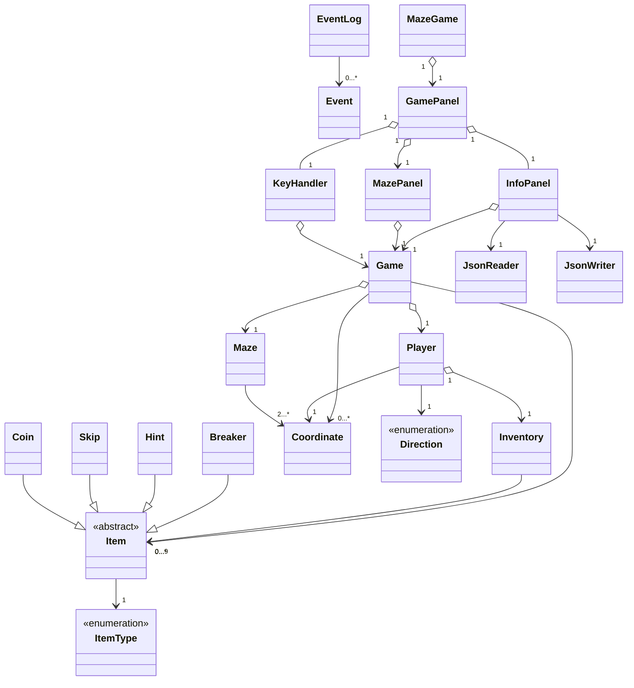

```mermaid
classDiagram
	class Item
	class ItemType
	<<abstract>> Item
	<<enumeration>> ItemType

	Item --> "1" ItemType
	Coin --|> Item
	Skip --|> Item
	Hint --|> Item
	Breaker --|> Item

	Maze --> "2...*" Coordinate

	class Direction
	<<enumeration>> Direction
	Player --> "1" Direction
	Player --> "1" Coordinate
	Player "1" o--> "1" Inventory

	Inventory --> "0...9" Item

	EventLog --> "0...*" Event

	Game o--> "1" Player
	Game o--> "1" Maze
	Game --> "0...*" Coordinate
	Game --> "0...*" Item


	KeyHandler o--> "1" Game

	MazePanel o--> "1" Game

	InfoPanel o--> "1" Game
	InfoPanel --> "1" JsonReader
	InfoPanel --> "1" JsonWriter

	GamePanel "1" o--> "1" MazePanel
	GamePanel "1" o-- "1" InfoPanel
	GamePanel "1" o-- "1" KeyHandler


	MazeGame "1" o--> "1" GamePanel
```